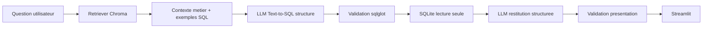

# Chatbot de reporting Text-to-SQL

Projet de stage permettant a un utilisateur metier d'interroger une base commerciale
SQLite en francais. L'application recupere le contexte metier, genere une requete SQL,
la valide, l'execute en lecture seule, puis affiche le resultat sous forme de KPI,
tableau ou graphique.

Le projet garde deux moteurs :

- **Mode simple sans API** : moteur deterministe base sur quelques regles, utile pour la demo.
- **LangChain + RAG + LLM** : pipeline principal avec RAG, sortie structuree Pydantic,
  validation SQL et restitution automatique.

Par defaut, le mode LangChain est configure pour **Ollama local** afin d'eviter le quota
payant OpenAI. OpenAI reste disponible si `LLM_PROVIDER=openai`.

## Architecture



Responsabilites principales :

- `app.py` : interface Streamlit.
- `src/config.py` : configuration `.env`.
- `src/llm_provider.py` : selection OpenAI ou Ollama.
- `src/rag/` : documents metier, Chroma et retrieval.
- `src/chains/` : chaines LangChain Text-to-SQL et interpretation.
- `src/sql/` : schema, validation et execution SQL.
- `src/services/reporting_service.py` : orchestration du pipeline.
- `tests/` : tests pytest.

## Installation Python

```powershell
python -m venv .venv
.\.venv\Scripts\Activate.ps1
python -m pip install -r requirements.txt
```

## Configuration locale gratuite avec Ollama

Installer Ollama, puis telecharger les deux modeles :

```powershell
ollama pull qwen2.5-coder:7b
ollama pull nomic-embed-text
```

Configuration `.env` conseillee :

```dotenv
LLM_PROVIDER=ollama
OLLAMA_BASE_URL=http://localhost:11434
OLLAMA_CHAT_MODEL=qwen2.5-coder:7b
OLLAMA_EMBEDDING_MODEL=nomic-embed-text
CHROMA_DIRECTORY=data/chroma_db
RAG_TOP_K=5
RAG_EXAMPLE_K=2
SQL_DIALECT=sqlite
SQL_ROW_LIMIT=100
SQL_TIMEOUT_SECONDS=5
DEFAULT_MODE=simple
```

Avec Ollama, il n'y a pas de facturation API. Le cout est local : temps de calcul,
memoire, stockage et performance de la machine.

## Configuration OpenAI API

L'API OpenAI est separee de l'abonnement ChatGPT et fonctionne avec une facturation a
l'usage. Pour l'utiliser :

```dotenv
LLM_PROVIDER=openai
OPENAI_API_KEY=sk-...
OPENAI_MODEL=gpt-4o-mini
OPENAI_EMBEDDING_MODEL=text-embedding-3-small
```

`.env` est ignore par Git. Ne pas publier ce fichier.

## Base SQLite

Creer ou recreer les donnees de demonstration :

```powershell
python database/create_database.py
```

La base est creee dans `data/reporting_demo.db` avec `clients`, `produits`,
`commandes` et `lignes_commandes`.

## Indexation RAG

Apres avoir configure le provider et telecharge les modeles Ollama si besoin :

```powershell
python -m src.rag.index_knowledge_base
```

Chroma utilise une collection differente selon le provider et le modele d'embedding, ce
qui evite les conflits entre embeddings OpenAI et Ollama.

## Lancement Streamlit

```powershell
streamlit run app.py
```

Ouvrir `http://localhost:8501`.

La sidebar permet de choisir le mode simple ou le mode LangChain. Le mode developpeur
affiche le contexte RAG, le SQL genere, les sorties structurees, les erreurs et les
temps d'execution. Les resultats peuvent etre exportes en CSV.

## Exemples de questions

```text
Quel est le chiffre d'affaires total ?
Quel est le chiffre d'affaires par region ?
Quels sont les 5 meilleurs clients ?
Quels sont les produits les plus vendus ?
Montre-moi les ventes par mois.
Compare les ventes de 2025 et 2026.
Quel est le panier moyen ?
```

## Securite SQL

Le validateur :

- autorise uniquement une instruction `SELECT`, avec CTE eventuel ;
- bloque `DROP`, `DELETE`, `UPDATE`, `INSERT`, `ALTER`, `TRUNCATE`, `CREATE`,
  `GRANT`, `REVOKE`, `PRAGMA`, `ATTACH` et `DETACH` ;
- refuse les requetes multiples ;
- verifie tables, colonnes et alias ;
- ajoute une limite de securite aux requetes detaillees sans `LIMIT`.

SQLite est ouvert en lecture seule avec timeout.

## Tests

```powershell
python -m pytest -q
```

Les tests couvrent le validateur SQL, le mode simple, la base, l'execution SELECT,
le RAG, les modeles structures et la configuration provider.

## Limites actuelles

- La qualite en local depend du modele Ollama choisi et de la machine.
- Le premier lancement local peut etre lent car les modeles se chargent en memoire.
- Le mode simple reste volontairement limite.
- Le RAG utilise Chroma local, sans Qdrant ni architecture serveur.
- La base SQLite reste une base de demonstration.

## Prochaines ameliorations

- Evaluer plusieurs modeles Ollama pour le Text-to-SQL.
- Ajouter une page d'evaluation plus visuelle.
- Ajouter une base PostgreSQL de demo en lecture seule.
- Enrichir les documents metier et les exemples SQL.
